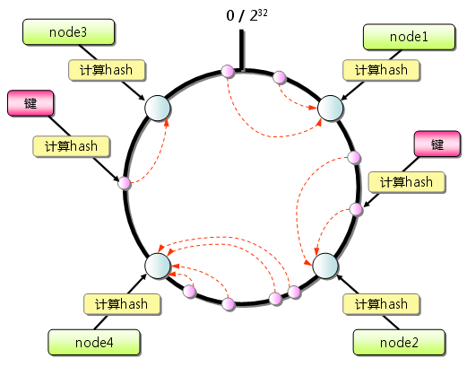
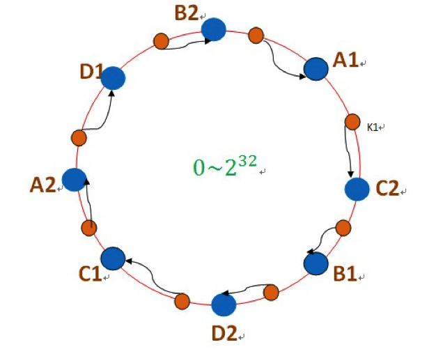

> 一致性Hash算法

## 解决什么问题
一致性Hashing在分布式系统中经常会被用到， 用于尽可能地降低节点变动带来的数据迁移开销，初衷是分布式环境下的负载均衡问题。
简单的Hash可以使请求分布在不同的服务机器上，但是出现宕机或者新增机器的时候，带来大量的数据或者job迁移，成本大。
如何解决这种节点变动带来的大量数据迁移和数据不均匀分配问题呢？Consistent Hashing是一种Hashing算法，典型的特征是：在减少或者添加节点时，可以尽可能地保证已经存在Key映射关系不变，尽可能地减少Key的迁移。
解决了如何在动态的网络拓扑中分布存储和路由。每个节点仅需维护少量相邻节点的信息，并且在节点加入/退出系统时，仅有相关的少量节点参与到拓扑的维护中。所有这一切使得一致性哈希成为第一个实用的DHT算法。

## 原理

一个巨大的环，节点node根据hash分散在不同位置，hash(node)：0~2~32-1，最大正整数。node比如可以是服务机器ip。
客户请求，计算出hash(user)，顺时针找到最近的node即可。

## 均匀一致性Hash

如果只有几个节点，可能会造成数据分布不均匀的情况，如何解决这个问题呢？虚拟节点能解决这个问题。

什么是虚拟节点？
简单说，就是在环上模拟很多个不存在的节点，这时候这些节点是可以尽可能均匀分布在环上的，在key的hash后，顺时针找最近的存储节点，存储完成之后，集群中的数据基本上就分配均匀了。唯一要做的，必须要维护一个虚拟节点到真实节点的关系。

## 应用场景

Memcache,redis缓存服务器

服务路由

应用服务器负载均衡

MySQL的分布式集群（分布式DB）

分布式session服务器，分布式共享文件

